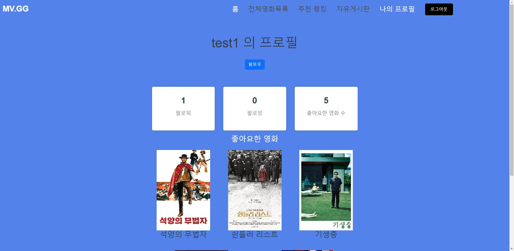

# MOVIE.GG

## 😎 팀원 + 업무

**FrontEnd** [김상진](<[]()>)

**Front / BackEnd** [김병민, 서지호](<[]()>)

- 필수 기능

| 이름   | 담당 작업                                                                                            |
| ------ | ---------------------------------------------------------------------------------------------------- |
| 김상진 | 전체 CSS, 영화 상세 조회                                                                             |
| 김병민 | 영화 상세 조회, 커뮤니티 게시글, 댓글, 영화 상세 좋아요                                              |
| 서지호 | ERD 설계, 로그인, 로그아웃, 회원가입, CRUD API, 영화 데이터 관리, 팔로우, 팔로잉 모델, 모델 폼, 로직,<br> Javascript와 Vue를 활용한 영화목록 조회, 프로필 조회, 영화 추천 페이지와 서버에서 API로 받아온 데이터를 요청 처리, <br>응답 전송, 상태 관리, 비동기 처리
 |

## 🛠️ 사용한 기술 🛠

**FrontEnd** Javascript / Vue / HTML / CSS / Bootstrap

**BackEnd** Python / Django

## ⚡ 구현 실패 ⚡

- 작품내 영화배우 리스트 출력과 그에 따른 배우 상세 정보 제공
  - 배우 json 파일과 영화 json 파일간에 키가 맞지않아 작업을 위해 배우 json을  
    포기해야 했고 그 결과 미구현인 상태로 남게 됨

<br>

## 📆 프로젝트 기간

- 2023.05.18 ~ 2022.05.25
- 8 DAY

## 🎞 프로젝트 구현

### 0. 개요

- **초기 ERD**
  
  **최종 ERD**
  

- **파일트리 (개요 (일부 생략)**

```
영화 추천
├─ movie_recommendation
│  ├─ .env.local
│  ├─ back_server
│  │  ├─ accounts
│  │  │  ├─ admin.py
│  │  │  ├─ apps.py
│  │  │  ├─ migrations
│  │  │  ├─ models.py
│  │  │  ├─ serializers.py
│  │  │  ├─ tests.py
│  │  │  ├─ urls.py
│  │  │  ├─ views.py
│  │  │  ├─ __init__.py
│  │  ├─ back_server
│  │  │  ├─ asgi.py
│  │  │  ├─ settings.py
│  │  │  ├─ urls.py
│  │  │  ├─ wsgi.py
│  │  │  ├─ __init__.py
│  │  ├─ community
│  │  │  ├─ admin.py
│  │  │  ├─ apps.py
│  │  │  ├─ migrations
│  │  │  ├─ models.py
│  │  │  ├─ serializers.py
│  │  │  ├─ tests.py
│  │  │  ├─ urls.py
│  │  │  ├─ views.py
│  │  │  ├─ __init__.py
│  │  ├─ db.sqlite3
│  │  ├─ manage.py
│  │  ├─ movies
│  │  │  ├─ admin.py
│  │  │  ├─ apps.py
│  │  │  ├─ fixtures
│  │  │  │  ├─ actors.json
│  │  │  │  ├─ genre.json
│  │  │  │  └─ movies.json
│  │  │  ├─ migrations
│  │  │  ├─ models.py
│  │  │  ├─ serializers.py
│  │  │  ├─ tests.py
│  │  │  ├─ urls.py
│  │  │  ├─ views.py
│  │  │  ├─ __init__.py
│  │  └─ requirements.txt
│  ├─ front_server
│  │  ├─ babel.config.js
│  │  ├─ jsconfig.json
│  │  ├─ package-lock.json
│  │  ├─ package.json
│  │  ├─ public
│  │  │  ├─ favicon.ico
│  │  │  └─ index.html
│  │  ├─ README.md
│  │  ├─ src
│  │  │  ├─ App.vue
│  │  │  ├─ assets
│  │  │  │  ├─ 겨울왕국.png
│  │  │  │  ├─ 골드.png
│  │  │  │  ├─ 다이아.png
│  │  │  │  ├─ 동석.png
│  │  │  ├─ components
│  │  │  │  ├─ CodePen.vue
│  │  │  │  ├─ CommunityDetail.vue
│  │  │  │  ├─ CommunityFormView.vue
│  │  │  │  ├─ Footer.vue
│  │  │  │  ├─ Header.vue
│  │  │  │  ├─ LoginButton.vue
│  │  │  │  ├─ MovieList.vue
│  │  │  │  ├─ MovieListItem.vue
│  │  │  │  ├─ NavBar.vue
│  │  │  │  ├─ SearchBar.vue
│  │  │  │  └─ SearchResults.vue
│  │  │  ├─ main.js
│  │  │  ├─ router
│  │  │  │  └─ index.js
│  │  │  ├─ store
│  │  │  │  └─ index.js
│  │  │  └─ views
│  │  │     ├─ AboutView.vue
│  │  │     ├─ Community.vue
│  │  │     ├─ HomeView.vue
│  │  │     ├─ LoginView.vue
│  │  │     ├─ MovieDetail.vue
│  │  │     ├─ MovieRanking.vue
│  │  │     ├─ MovieView.vue
│  │  │     ├─ NotFound404.vue
│  │  │     ├─ ProFile.vue
│  │  │     └─ SignupView.vue
│  │  └─ vue.config.js
└─ TMDB_DATA_JSON.py
```

### 1. MOVIE

- **홈 페이지**
  

- 검색

  - 사용자가 입력한 내용에 해당되는 영화 리스트를 출력
  - 입력된 내용이 없을시 알림과 함께 이미지 출력

    <br>

- **전체 영화 페이지**
  

- 카드 디테일

  - 카드 형태로 전체 영화 목록을 제공
  - 카드 클릭시 영화 상세 페이지로 이동
  - 한 페이지에 3개씩 제공
  - Next 버튼을 눌러서 다음 목록 조회
  - 마지막 데이터에 도달시 Next 버튼 제거

    <br>

- **추천 랭킹 페이지**
  

  - 평점순위에 기반한 장르별 영화 추천 알고리즘
  - 제목 클릭시 영화 상세 페이지로 이동

    <br>

  

  - 특정 장르 선택시 필터링 기능 제공

    <br>

- **영화 상세 페이지**
  
  - 영화의 자세한 데이터 제공
  - 예고편 재생
  - 좋아요 버튼 클릭시 프로필 창에서 확인 가능
  - 좋아하는 유저수 표시

### 2. COMMUNITY

- **게시판 페이지**
  

   - 게시글 작성 가능 - 인증된 유저만 작성 가능 - 제목 누를시 상세 게시글 페이지로 이동 - 작성자 누를시 해당 유저의 프로필 페이지로 이동

- **게시글**
  

  - 작성자와 작성일 확인 가능
  - 상세 게시글 확인 가능
  - 수정, 삭제 가능
  - 댓글 작성 가능

### 3.

- **프로필 페이지**
  

  - 팔로우 버튼 클릭시 해당 유저 팔로우 가능 (본인을 팔로우시 알림창)
  - 팔로워와 팔로잉 숫자 제공
  - 좋아요 버튼을 누른 영화 개수와 해당 영화 목록 출력
  - 영화 포스터 클릭시 해당 영화의 상세 페이지로 이동

### 4.

-**로그인 페이지**


    - 로그인 기능 제공
    - 회원가입 버튼을 눌러서 회원가입 절차 진행

## 🌄 느낀점

- 김상진

  ```
  사실 개발공부를 시작한지 얼마 안됬다고 생각해서 내가 잘 할 수 있을까 라는 생각이 들었지만 협업 프로젝트를 하다보며
  모르는 부분은 팀원에게 물어보며 책임감을 가지고 하다 보니 실력 향상에 크게 도움이 되었다고 생각한다.
  이번 프로젝트를 하며 부족했던 부분이 뭔지 좀 더 자세히 알게 되었고 방학 때 부족했던 부분을 보완해야 겠다.
  ```

- 김병민

  ```
  처음에 model과 serializer를 작성한 뒤, back의 url과 view를 다 적고나니, 
  이정도면 완성되었다고 생각해서 front의 vue를 만들고 back과 axios로 통신하도록 했는데, 
  500, 401, 404 등 수많은 에러가 계속 뜨고 그 에러를 하나 하나 디버깅 해나가는 데
  코드 작성하는 시간보다 더 많은 시간이 걸렸다. 특히 변수명 대문자 소문자 하나가 틀려서
  데이터 전달이 안 되는 경우에 많이 시간이 잡아 먹혔다. 오류를 하나하나 고쳐가다 보니
  결과물이 나왔지만, 아직 노 베이스로 코드를 작성하기엔 부족함이 많아 더욱 노력해야겠다 생각이 들었다.
  ```

- 서지호

  ```
  back 과 front 간의 원할한 통신을 위해 url과 초기 erd 키들을 자세하게 설정하는게 중요하다고 느끼는 프로젝트의 연속이었다.

  처음 시작할땐 막막했지만 하다보니 어떻게든 되서 마무리 할 수 있었다.

  전체적인 복습을 통해 어느정도 배운걸 이해할수 있었고
  2학기도 실력을 많이 높일수 있으면 좋겠다.
  ```
